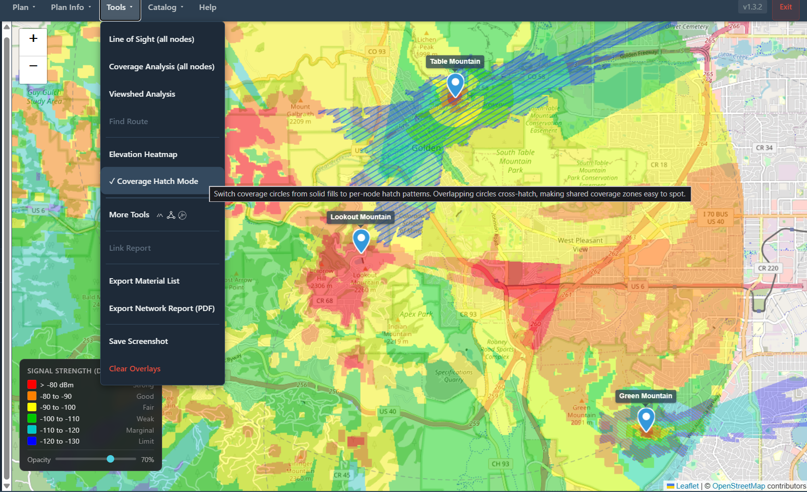
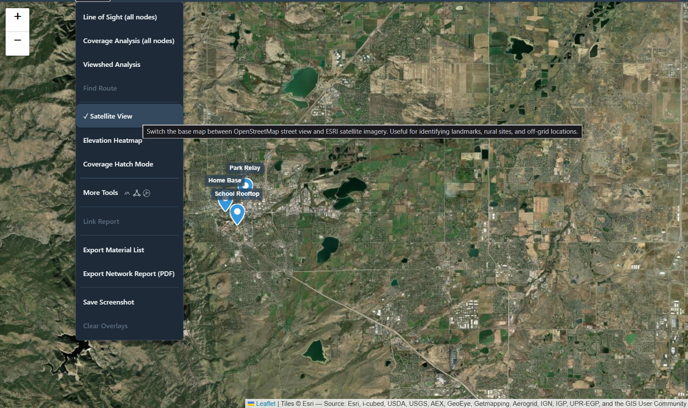

# Changelog

All notable changes to Mesh Community Planner are documented in this file.

The format is based on [Keep a Changelog](https://keepachangelog.com/en/1.1.0/).

---

## [1.3.4] — 2026-03-23

### Added

- **Coverage Hatch Mode** — new toggle in the Tools menu that marks overlapping terrain coverage zones with per-node diagonal hatch patterns. Each node's signal footprint is assigned a unique color and stripe direction; where two footprints share coverage, the stripes visually cross-hatch, making shared zones immediately legible without obscuring the underlying signal-strength heatmap.

  Hatch detection is pixel-accurate: the overlap is computed by comparing the actual raster heatmap images (not the circular analysis boundary), so only pixels where both nodes have measurable signal (-80 to -130 dBm) are hatched. Three or more overlapping nodes accumulate multiple hatch layers, producing progressively denser patterns.

  

- **Satellite View** — new toggle in the Tools menu that switches the base map between OpenStreetMap street view and ESRI World Imagery satellite photography. Particularly useful for rural and off-grid site planning where landmarks and terrain features matter more than road names. Tiles cache locally after first view, enabling offline use thereafter.

  Satellite imagery provided by ESRI World Imagery. *Imagery © Esri — Source: Esri, i-cubed, USDA, USGS, AEX, GeoEye, Getmapping, Aerogrid, IGN, IGP, UPR-EGP, and the GIS User Community.*

  

---

## [1.3.3] — 2026-03-18

### Added

- **Intel Mac DMG** — a native x86_64 disk image (`MeshCommunityPlanner-1.3.3-x86_64.dmg`) is now included in every release, built via Rosetta 2 on a self-hosted Apple Silicon runner. Intel Mac users no longer need to build from source to get the pre-packaged app.

### Changed

- Downloads table in README and Installation Guide updated to list both Apple Silicon and Intel DMG files separately.
- macOS section in Installation Guide updated: removed "Intel users must build from source" warning; replaced with chip-selection guidance.

---

## [1.3.2] — 2026-03-15

### Added

#### Internet Map Import — Dual Source (MeshCore + Reticulum)
- **Reticulum Network** added as a second live source alongside MeshCore Map in the Import Nodes (Internet) dialog
- Source cards use `aria-pressed` keyboard navigation; both show a **LIVE** badge; modal title updates dynamically to the selected source
- Reticulum pulls from `directory.rns.recipes` — deduplicates by (name, lat, lon rounded to 4dp), filters null-island (0,0) nodes
- Same 5-node bulk-import warning threshold applies to both sources

#### Offline Guard
- Import Nodes (Internet) button automatically disables and labels itself **(offline)** when no internet connection is detected at startup or on network change
- All other features (propagation, LOS, BOM, CSV, KML) continue to work fully offline

#### KML Export Help Dialog
- After a .kml file downloads, a modal lists compatible apps with per-app import instructions:
  - **Mobile:** ATAK CIV / iTAK / WinTAK, Caltopo, Gaia GPS, OsmAnd, Avenza Maps, OruxMaps
  - **Desktop:** Google Earth, QGIS, ArcGIS, Google My Maps

#### Post-Deployment Signal Validation — Import Signal Data (CSV)
- **Import Signal Data (CSV)** in the Plan menu — import real-world RSSI/SNR link observations and compare them against modeled predictions
- Accepts CSV exports from Meshtastic, MeshCore, or any tool producing node-pair signal data; auto-detects column names (`from`/`to`, `node_a`/`node_b`, `rssi`, `snr`, `timestamp`)
- Two-phase modal: Phase 1 file upload with parse summary (rows parsed, rows skipped, skip reasons); Phase 2 link table with plan node match status and RSSI color coding (green >-85 dBm, yellow -85 to -100 dBm, red <-100 dBm)
- Matched links imported as a Signal overlay — colored polylines, hover tooltips with observed RSSI/SNR
- Backend validates RSSI (-140 to 0 dBm) and SNR (-20 to +20 dB), truncates at 500 rows

#### GitHub Actions Release Workflow
- `.github/workflows/release.yml` — push a `v*` tag to trigger parallel platform builds:
  - **macOS** (`macos-14`, Apple Silicon) — PyInstaller `.app` bundle → `create-dmg` DMG with drag-to-Applications window
  - **Linux** (`ubuntu-22.04`) — PyInstaller output → `appimagetool` AppImage with widest glibc compatibility
  - **Windows** (`windows-latest`) — PyInstaller EXE directory zipped
- Draft GitHub Release auto-created with generated release notes; stays draft until manually published
- `APP_VERSION` env var plumbed through `build_dmg.sh` and `build_appimage.sh` so artifact filenames match the tag

### Fixed
- **SQLite WAL corruption** — force-killing the process (`taskkill /F`, power loss) skipped the WAL checkpoint, leaving the DB in an unrecoverable state on next launch. Backend now enforces WAL journaling mode, runs `PRAGMA wal_checkpoint(TRUNCATE)` on startup, and auto-restores sample plans if the DB is found empty after a dirty exit
- **Firefox Playwright crashes** — parallel test teardown triggered `_maybeDontRestoreTabs` protocol error in Firefox. Fixed with `firefoxUserPrefs` disabling session-restore in `playwright.config.ts`
- **RNS Transport Advisor** — removed `clientCount` input that was collected but never used in any calculation
- **RNS Throughput Analyzer** — removed `hops` field per interface segment that was never factored into bottleneck or timing calculations

### Removed
- **Live ATAK KML feed** — `GET /api/atak/nodes.kml`, `GET /api/atak/local-url`, the ATAKUrlPanel sidebar widget, and all bundled static KML icons (`mesh_node.png`, `repeater.png`, `gateway.png`). Play Store ATAK 5.6 disables cleartext HTTP at the Android system level; requiring users to install a self-signed certificate is not acceptable UX. Static KML export with the new app guide is the correct story for 100% of users.
- **Dead code** — unimported `App.css` (Vite boilerplate), orphaned `BOMTable.tsx` scaffold, duplicate `bom/PropagationProgress.tsx`, dead `.moretools-coming-soon` CSS class

### Tests
- Frontend: 437 passing — 19 test files (Vitest + Testing Library + jest-axe)
- Backend: 199 passing (pytest)

---

## [1.3.1] — 2026-03-15

### Added

#### MeshCore Tools — RF Channel Frequency Coordinator (More Tools → MeshCore)
- **RF Channel Frequency Coordinator** — assigns non-interfering center frequencies to co-located independent MeshCore networks in metro deployments
- Inputs: region (US/EU/ANZ), bandwidth (62.5/125/250 kHz), number of zones (2–8), zone names, pairwise geographic overlap matrix
- Greedy graph coloring assigns the lowest available channel index to each zone; overlapping zones always receive different frequencies
- Outputs: channel spacing used, available channel count in band, per-zone center frequency table, feasibility (PASS/CONFLICT)
- Conflict warning when the number of mutually-overlapping zones exceeds available channels in the selected band

#### Reticulum Tools — Multi-Interface Throughput Analyzer (More Tools → Reticulum)
- **Multi-Interface Throughput Analyzer** — calculates effective end-to-end throughput and LXMF message delivery time across mixed-interface Reticulum paths
- Up to 4 interface segments: LoRa RNode, WiFi, TCP/IP, I2P — each with configurable data rate; defaults auto-set on type change
- Transfer types: LXMF Message (adds 80-byte header), Raw Link Data, Announce Packet (fixed 167 bytes)
- Cold path: adds 297-byte link establishment overhead; warm path: transfer only
- I2P segments add 5,000 ms tunnel setup latency
- Outputs: bottleneck interface, effective throughput (auto-scaled bps/kbps/Mbps), link establishment time, transfer time, total delivery time, LXMF overhead %, RNS 5 bps minimum check
- Bottleneck recommendation identifies which interface is limiting the path

### Tests
- Frontend: 371 passing (Vitest + Testing Library + jest-axe)
- Backend: 154 passing (pytest) — unchanged

---

## [1.3.0] — 2026-03-14

### Added

#### ATAK Live KML Integration
- **Live KML endpoint** — `GET /api/atak/nodes.kml` serves all plan nodes as a KML feed that ATAK can poll on a configurable interval (no TAK Server required)
- Node types automatically classified into three styles: Mesh Node (green), Repeater (orange), Gateway (red), each with a distinct icon
- Nodes grouped into KML `<Folder>` elements by type for clean layer management in ATAK's overlay panel
- Rich HTML popups in each placemark: plan name, frequency, antenna height, coverage environment, device ID
- **`GET /api/atak/local-url`** — returns the machine's LAN IP pre-formatted as an ATAK-ready URL
- **ATAK Integration panel** in sidebar (under plan details): shows polling URL, Copy URL button, optional plan filter, and an IP Override field for cross-subnet/NAT deployments
- Static icon PNGs served at `/static/icons/` and bundled in the PyInstaller exe

#### MeshCore Tools (More Tools → MeshCore tab)
- **Airtime & Duty Cycle Budget Calculator** — LoRa time-on-air math for MeshCore packets, projected duty cycle at current traffic load, required Airtime Factor (AF) to hit a target duty cycle, EU regulatory compliance check (10% limit on 869.525 MHz sub-band), headroom display. Key formula: `duty_cycle = 100 / (AF + 1)`
- **Network Density Planner** — calculates clients-per-repeater vs the 32-client ACL hard limit, neighbor table saturation vs the 50-node limit, flood packet count per message, channel airtime consumed by flood traffic alone, recommended `flood.max` setting, and txdelay tier. Includes callout explaining the counterintuitive "more repeaters = more flood copies" dynamic

#### Reticulum / RNS Tools (More Tools → Reticulum tab)
- **RNode Link Budget & Range Estimator** — full Friis link budget for SX1276 and SX1262 chipsets. Inputs: chipset, Tx power, SF, BW, CR, frequency band, antenna gains, cable loss, environment fade margin, required link margin. Outputs: data rate (bps), time-on-air for 500-byte RNS MTU, max FSPL budget, estimated reliable range with qualitative band, RNS 5 bps minimum threshold check
- **Transport Node Placement Advisor** — calculates announce traffic load vs the 2% RNS bandwidth budget, recommended minimum transport node count, path redundancy / single-point-of-failure detection, interface mode guidance (access_point / gateway / boundary / full), convergence degradation warning for oversized networks

#### Per-Node Coverage Environment
- Each node can now have its own coverage environment override (LOS / Rural / Suburban / Urban / Indoor)
- Colored badges on node list: blue=LOS, green=Rural, yellow=Suburban, red=Urban, purple=Indoor, gray=Global (inheriting global setting)
- Bulk set: multi-select nodes and apply an environment to all at once
- Coverage analysis uses per-node override with fallback to global setting
- DB migration `005_add_node_coverage_environment.sql`

#### Internet Map Import
- **Import Nodes from Internet Map** (Plan menu) — import nodes from MeshCore's live map (`map.meshcore.dev`) directly into the active plan. Decoded from msgpack binary API server-side. Phase 1: source selection. Phase 2: scrollable node table with checkboxes, filter, Select/Deselect All

#### More Tools Modal — Protocol-First UX
- Tools dropdown now leads with "More Tools" entry showing three protocol icons (Meshtastic, MeshCore, Reticulum)
- Modal opens to a protocol selector; choosing a protocol shows only that protocol's tools
- All "coming soon" placeholders removed as tools are now present for all three protocols

### Fixed
- **Radio horizon cap** — Max Radius input is now dynamically capped at the computed radio horizon for the selected node's antenna height. Horizon scales with antenna height (3m → ~37 km, 10m → ~48 km). No button needed; the input itself enforces the physics
- **Coverage analysis scope** — "All nodes" analysis was computing nodes across all loaded plans simultaneously. Now correctly scoped to the active plan only
- **Unsaved changes save button** — When the dirty asterisk (`*`) appears next to the plan name, an inline orange Save button now appears. One click persists plan metadata and clears the flag
- **Plan name overflow** — Long plan names now truncate with ellipsis so the save button always remains visible
- **Number inputs** — All 30+ number inputs across the app use the new `NumberInput` component: free typing while focused, commits and clamps on blur/Enter, Escape reverts

### Changed
- More Tools protocol icons updated: Meshtastic M-mark, custom MeshCore triangle-nodes, correct RNS double-ring logo (was wrong wordmark SVG)
- Radio horizon note converted from collapsible `
` to always-visible inline hint
- "Drag to move" hint moved inline inside modal title on all 8 draggable modals
- Coverage Environment dropdown labelled "(Global Setting)" with expandable explanation

### Tests
- Frontend: 318 passing (Vitest + Testing Library + jest-axe)
- Backend: 154 passing (pytest)

---

## [1.2.0] — 2026-03

### Added
- **Elevation Heatmap** — Toggle a terrain elevation overlay on the map (Tools > Elevation Heatmap)
  - Hypsometric color ramp: blue (sea level) → green → yellow → orange → terracotta → gray → white (snow)
  - On-demand SRTM tile download from AWS S3 (no auth required)
  - Rendered 256×256 PNG tiles cached to disk for instant subsequent loads
  - Zoom levels 9–15 (matched to SRTM 30m resolution)
  - Pure-Python PNG encoder (no Pillow dependency)
  - Auth bypass for tile GET requests (query param token for Leaflet compatibility)
- **Elevation Range Controls** — Full-featured min/max elevation bounds in the legend panel
  - Dual-handle range slider with coloured fill; drag Min/Max thumbs simultaneously on one track
  - Min/Max number fields for precise direct entry; press Enter to commit, Escape to cancel
  - Mouse wheel fine-tuning on a focused slider thumb (±10m per tick; page scroll suppressed)
  - Keyboard navigation: arrow keys ±10m, **Page Up/Down** ±100m
  - Dynamic legend swatches recompute terrain colors (with terrain-type labels) to match the current range
  - Reset button restores the full default range (-500m to 9000m)
  - **"Remember range" checkbox** persists Min/Max to `localStorage` across sessions; build-ID gated so new builds start fresh
  - Range-specific tile caching; backend dynamic color interpolation with same 10-stop ramp
  - Full ARIA labels and keyboard focus indicators on all controls
- **Exit Application Dialog** — Top-level Exit button with styled confirmation dialog
  - Danger variant (red header) with Cancel, Exit, and X close buttons
  - Full focus trap (Tab/Shift+Tab cycle within dialog); Escape dismisses
  - `role="alertdialog"` and `aria-modal="true"` for screen reader support
  - Browser `beforeunload` safety net for accidental tab closes (production only)
  - Intentional exit bypasses browser's native "Leave site?" prompt
- **Windowless mode** — Windows build runs without a visible console window
- **Elevation Tile Streaming Guide** — `ELEVATION-TILE-STREAMING.md` developer documentation for adapting the tile pipeline to other servers (e.g., ATAK)
- **Test suite** — 241 automated tests
  - 36 backend Python tests (pytest): PNG encoder, tile renderer, color ramp, ranged color interpolation, API endpoints, auth middleware
  - 73 frontend unit tests (Vitest): Zustand store, ElevationLegend, ConfirmDialog (ARIA, focus trap, axe), mapStore (buildId persistence), Toolbar
  - 132 Playwright integration tests (Chromium + Firefox + WebKit): end-to-end elevation UI, exit-app dialog, accessibility

### Fixed
- Elevation legend opacity slider now has `aria-label` for screen reader accessibility
- Checkbox and number input vertical sizing in elevation legend panel
- `beforeunload` event no longer blocks Playwright tests in dev mode

---

## [1.0.0] — 2026-02

First production release.

### Added
- Interactive map interface with OpenStreetMap and node placement
- Node Configuration Wizard (5-step guided setup: Basic Info, Device, Radio, Antenna, Power)
- Hardware catalog with 11+ LoRa devices across Meshtastic, MeshCore, and Reticulum/RNode
- Regulatory presets for US FCC 915, EU 868, EU 433, and ANZ
- Free-space path loss (FSPL) instant coverage preview
- Terrain-aware propagation analysis (Longley-Rice/ITWOM)
- SRTM 30m terrain data with automatic download and local caching
- Line-of-sight terrain profiles with Fresnel zone clearance visualization
- Network topology graph (D3.js) with critical node detection and resilience metrics
- Power budgeting with battery and solar deployment recommendations
- Bill of materials generation with CSV and PDF export
- Printable deployment cards (one per node) for field installation
- Plan management: create, rename, duplicate, delete, auto-save
- Import/export in .meshplan JSON format with SHA-256 checksums
- Single-node export (.meshnode) and reusable templates (.meshtemplate)
- CSV bulk node import with column auto-detection
- KML export for Google Earth
- Address search via Nominatim geocoding
- 4 built-in sample plans seeded on first launch
- WCAG 2.2 AA accessibility with full keyboard navigation and screen reader support
- Offline operation after initial map and terrain data caching
- Privacy-first architecture: all data local, no telemetry, no accounts
- Cross-platform installers: Windows (.exe), macOS (.dmg), Linux (AppImage)
- Auto-open browser on application startup
- Clean shutdown when browser tab is closed
